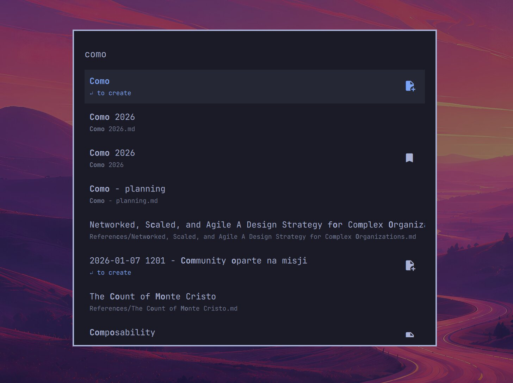

# Obsidian Quick Switcher for Omarchy

An Omarchy search panel that tries to feel like Obsidian's built-in Quick
Switcher. Press a shortcut, start typing, and jump straight to the file you
want.

- Fuzzy-search every vault file - not just Markdown
- Search aliases and bookmarks
- Create missing linked notes or a new note from any query
- Open files in Obsidian, launching Obsidian first when needed



## Requirements

- Omarchy Quattro or newer
- Obsidian with its CLI enabled
- `fzf`

## Install

```bash
omarchy plugin add https://github.com/mateuszkowalczyk/omarchy-obsidian-quick-switcher --enable
```

### Enable the Obsidian CLI

In Obsidian, go to **Settings → General → Advanced** and turn on **Command line
interface**. The switcher uses the CLI to find and open files in
your vault.

## Binding

Add this to `~/.config/hypr/bindings.lua`:

```lua
hl.unbind("SUPER + SHIFT + O")
o.bind(
  "SUPER + SHIFT + O",
  "Obsidian quick switcher",
  "omarchy-shell shell toggle mateuszkowalczyk.obsidian-quick-switcher '{}'"
)
```

The switcher launches Obsidian automatically if it is not already running.

## Keys

| Key | Action |
| --- | --- |
| Type | Fuzzy-search file names, paths, aliases, bookmarks, and unresolved links |
| `↑` / `↓` or `Ctrl` + `P` / `N` | Move through results |
| `Page Up` / `Page Down` | Move by a page |
| `Enter` | Open the selected file |
| `Shift` + `Enter` | Create and open a new note using the query |
| `Esc` | Clear the query, then close the panel |


## Remove

```bash
omarchy plugin remove mateuszkowalczyk.obsidian-quick-switcher
```

## License

MIT
